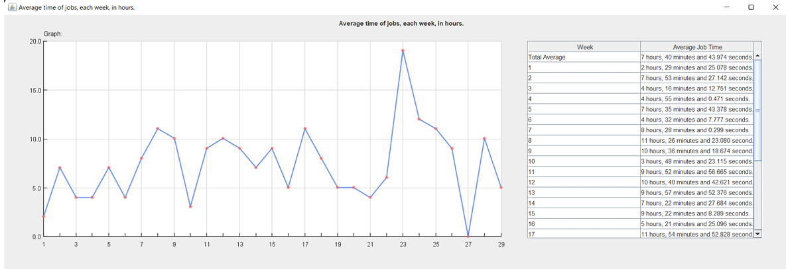

# Fundamentals of Programming Project

## Introduction
The University of Malaya established the Data Intensive Computing Centre (DICC) to offer High Performance Computing (HPC) facilities to the university community. High performance computing involves using supercomputers or connected computers to solve complex problems requiring significant computation and data. This project aims to analyze log data extracted from SLURM (extract log file) by developing a program to extract and present relevant information in tables and graphs.

## Requirement Analysis
The project aims to develop a program capable providing statistics of:
- Jobs by partitions.
- Classifying job errors and their corresponding types.
- Calculating the average execution time of jobs submitted to UMHPC.
- Identifying jobs killed in the log file.
- Presenting data in tables and graphs for easier understanding.

## Scope
This project includes features such as statistical analysis of:
- Job partition coordination.
- Job error classification.
- Average execution time calculation.
- Job killing identification.
- Data presentation in tables and graphs.

## Constraints
- Accessibility of the system.
- Ease of use.
- Ability to handle large files.

## Plan and Strategy
- **Data Visualization:** Create visual representations like graphs and tables to identify patterns and trends.
- **Performance Optimization:** Use collected data to optimize system performance and resource allocation.

## Architectural Design
The source code extracts data from log files, particularly SLURM files, and processes it into understandable information. It utilizes methods like regular expressions and data parsing to extract relevant information and presents it in graphical and tabular forms. javax library was used for custum GUI windows.

## Result and Findings
The program provides statistical data and tables/graphs for analysis. Various metrics can be extracted and displayed, aiding in system monitoring and optimization.

## Challenges and Solutions
- **Slow Runtime:** Addressed by using BufferedReader and ArrayList for efficient data handling.
- **Inaccurate Data:** Mitigated by refining data filtering methods.
- **GUI Libraries Issues:** Overcame by using JavaX.Swing and java.awt for graphical components.
---
